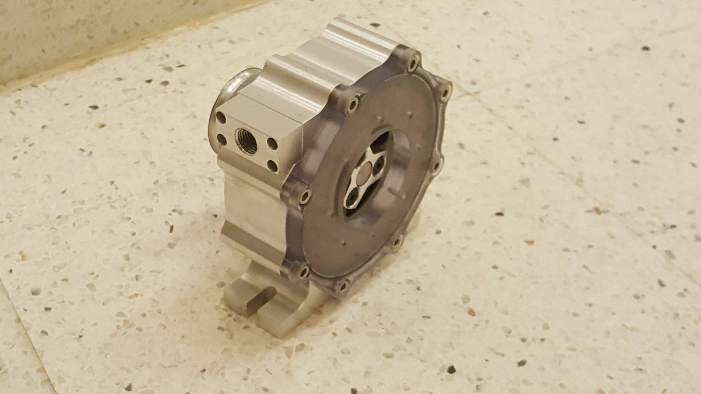

# My Projects

Below is a quick description of many of my recent projects. Most of them have additional information if you click the title.

## [Autonomous Drone Landing](iv_lab.html)

<video width="600" height="350" controls>
  <source src="images/drone_landing.mp4#t=21" type="video/mp4">
      Your browser won't let you see the cool video. :(
</video>

The Olin Intelligent Vehicles Lab does a lot of work with multirtors, especially in ocean applications; however, flying a drone from a boat requires a skilled pilot to safely recover the drone. In this project, I developed a system capable of using a camera and GPS, which are both common in most drone missions, to detect and land within about 0.5m of a target (as opposed to up to 6m with GPS alone). [click here for more about my work in the Intelligent Vehicles Lab](iv_lab.html)

**Relevant Skills:** Linux, Python, ROS, Hardware Prototyping, System Design

## Robotic Systems Integration

<video width="600" height="350" controls>
  <source src="images/Bravobot_Final_Video.mp4" type="video/mp4">
      Your browser won't let you see the cool video. :(
</video>

In this full semsester project, I worked in a team of five to take a semi-functional robot and program it to follow someone, keep track of where it is in a map, and make comments based on the person's location in the building. To robustly follow the target person, we fused camera and lidar data to get a somewhat depth-informed image, which allowed us to consistently detect the person with few false positives. We also developed an angorithm for autonomously calibrating a color threshold for detecting a person's pants. This feature, along with an informative set of light patterns allowed us to develop an intuitive user interaction. [click here to see our project wiki](https://github.com/RRameshwar/bravobot/wiki)

**Relevant Skills:** Linux, C++, ROS, Arduino, Debugging

## Fundamentals of Machine Shop Opperations

The final project for this class was to machine a Tesla Turbine usig a maual lathe, manual mill, and 2 axis CNC mill The tesla turbine is interesting because the air flows parallel to the "blades" and all of the propultion is the result of viscous forces (as opposed to conventional turbines which are driven by momentum). To test the turbie, we used shop air to spin it up to 25,000 rpm.

**Relevant Skills:** Machining

## [Principles of Engineering](POE.html)

<video width="600" height="350" controls>
  <source src="images/hexbot.mpeg" type="video/mpeg">
      Your browser won't let you see the cool video. :(
</video>

This six week project was an entirely open ended project where my team of five decided to build a hexapod robot. By the end of the project, we had a fully functional platform capable of autonomously moving in straight lines and turning. [click here for more about the project](POE.html)

**Relevant Skills:** Linux, Python, Arduino, Mechanical Design (OnShape), Dynamics, Debugging

## Fundamentals of Robitics

<video width="600" height="350" controls>
  <source src="images/funrobo.mp4#t=8" type="video/mp4">
      Your browser won't let you see the cool video. :(
</video>

In this final project for Fundamentals of Robotics, I was on a team of three working to make this tugboat autonomousy navigate around a pool using onboard IR distance sensors and an artificial GPS (positions from a ceiling mounted camera)

**Relevant Skills:** LabView

## [Mecanum Bot](mecanum.html)

<video width="600" height="350" controls>
  <source src="images/mecanum.mp4" type="video/mp4">
      Your browser won't let you see the cool video. :(
</video>

This was a quick project I did at the end of freshmen year in order to explore 3D printing and make myself something interesting. My high school robotics team discussed mecanum drive robots a few times but never built one, so I wanted to try it out. [click here for more about my design](mecanum.html)

**Relevant Skills:** Mechanical Design (SolidWorks), Rapid Prototyping, Arduino, Electrical Prototyping

## [Design Nature](des_nat.html)

<video width="600" height="350" controls>
  <source src="images/hopper.mp4" type="video/mp4">
    Your browser won't let you see the cool video. :(
</video>

This was the first project at Olin. The goal was to design a hopping toy inspired by an insect. This is inspired by the click beetle, which flips istelf over by folding itself in half fast enough to fling itself in the air. [click here for more about how it works](des_nat.html)

**Relevant Skills:** Mechanical Design (SolidWorks)

